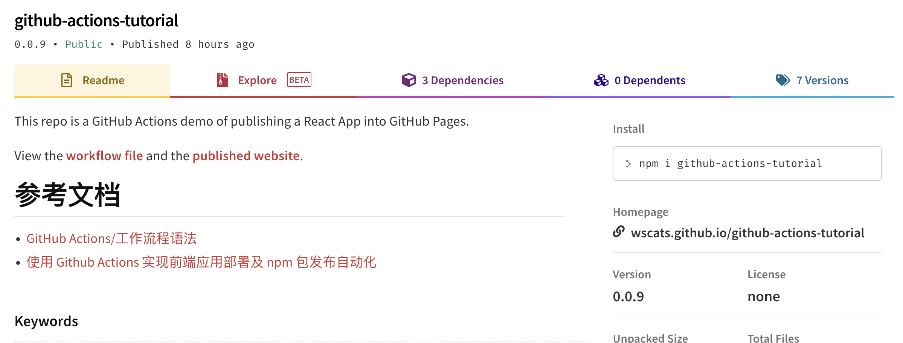
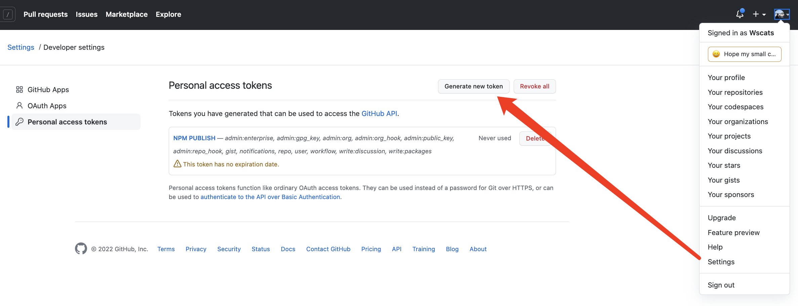
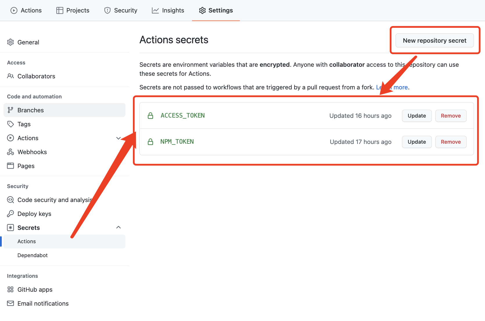
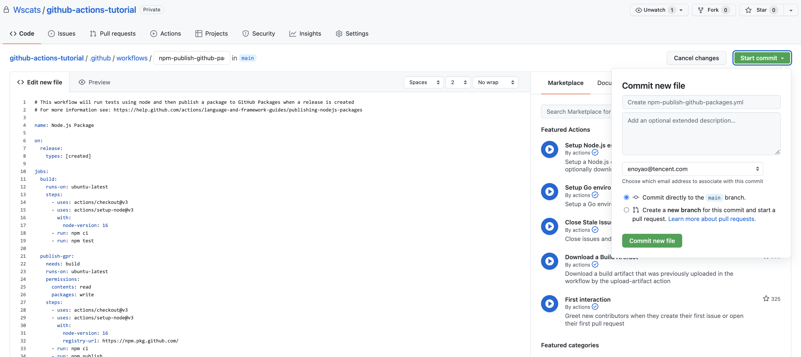
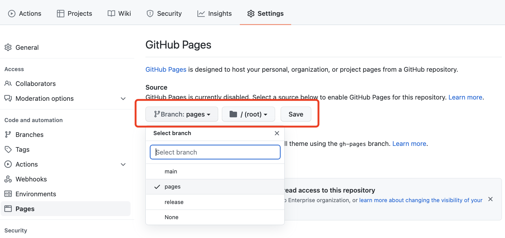

# 用于 GitHub Actions 自动发布 Npm 包和网站

自从 GitHub 宣布 GitHub Actions 在平台上对所有开发人员和存储库可用以来，GitHub Actions 越来越受欢迎。很多第三方平台在生态系统中有速度等限制，将进一步推动开发人员将他们的软件自动化迁移到 GitHub Actions。

在本文中，我想向你展示我如何使用 GitHub Actions 发布我在开源项目中维护的 npm 包。如果你遵循由 GitHub 拉取请求工作流程组成的 GitHub 流程，那么这将进一步统一团队和社区贡献者的工作流程的和提升他们的体验。

# GitHub Actions

GitHub Actions 是 GitHub 开发的一项技术，旨在为开发人员提供一种围绕持续集成自动化其工作流程的方法——帮助他们构建、部署、安排重复性任务等。GitHub Actions 原生可用并集成到 GitHub 存储库中，并具有来自社区贡献者的许多可重用工作流，例如发布 npm 包、发布 docker 图像、运行安全测试等等。

Github Action 本质就是 Github 推出的持续集成工具, 每次提交代码到 Github 的仓库后，Github 都会自动创建一个虚拟机（例如 Mac / Windows / Linux），来执行一段或多段指令，例如：

```bash
npm install
npm run build
```

我们集成 Github Action 的做法，就是在我们仓库的根目录下，创建一个 .github 文件夹，里面放一个 `*.yaml` 文件, 这个 Yaml 文件就是我们配置 Github Action 所用的文件。

# Github Action 的使用限制

- 每个 Workflow 中的 job 最多可以执行 6 个小时
- 每个 Workflow 最多可以执行 72 小时
- 每个 Workflow 中的 job 最多可以排队 24 小时
- 在一个存储库所有 Action 中，一个小时最多可以执行 1000 个 API 请求
- 并发工作数：Linux：20，Mac：5

# 什么是 GitHub Workflow？

GitHub 工作流是一组基于触发器或基于 cron 的计划运行的 job 作业。作业由组成自动化工作流程的一个或多个步骤组成。我们通过创建 YAML 文件来创建 Workflow 配置。

# 从零搭建 Npm 包持续集成

在了解了基本的知识之后，我将通过一个实际的项目来带大家快速上手 Github Action，最终实现的目标: 当我们将代码推送到 github 上后, 通过 Github Action 自动打包项目，并一键发布到 npm 上和发布一个 Github Page 网站。



## 获取 Npm Access Token

要想让 Github Action 能有权利发布指定的 npm 包, 需要获取 npm 的 通行证. 这个通行证就是 npm token, 所以我们需要登入 npm 官网, 生成一个 token。


## 获取 Personal Access Token

点击 Generate new token 生成一个新的 token 并复制，需要注意的事，这个 Personal Access Token 跟上面 Npm Access Token 一样只会在生成成功的时候展示，一旦退出就无法再查看，所以要记得保存。



## 设置 Github Secret

我们在拿到 npm token 后, 打开对应项目的 Github 仓库, 切换到 settings 面板, 找到 secrets 子菜单, 创建一个新的 secret, 将 npm token 复制到内容区并命名



填写 Name 和 Value 字段，Name 为 ACCESS_TOKEN 和 NODE_AUTH_TOKEN，Value 为刚刚保存的 Personal Access Token 和 Npm Access Token 值。

| Token Name            | Key             | Vale                        |
| --------------------- | --------------- | --------------------------- |
| Personal Access Token | ACCESS_TOKEN    | ${{ secrets.ACCESS_TOKEN }} |
| Npm Access Token      | NODE_AUTH_TOKEN | ${{secrets.NPM_TOKEN}}      |

## 使用 Workflows 模板

我们切换到 actions 面板可以看到很多 workflows 模版，我们选择如下模版:


当然如果属性 yaml 配置的也可以自己创建一个 workflow 供他人使用。

我们点击安装按钮之后会跳转到编辑界面，我们可以直接点击右上放的提交按钮:



此时就创建了一个 workflow。

## 配置 workflows

这里我列一下 github-actions-tutorial 的 workflow：

```yaml
name: Node.js Package

# 触发工作流程的事件
on:
  push:
    branches:
      - main
      - "releases/**"
      - dev

# 按顺序运行作业
jobs:
  publish-gpr:
    # 指定的运行器环境
    runs-on: ubuntu-latest
    # 设置 node 版本
    strategy:
      matrix:
        node-version: [16]
    steps:
      # 拉取 github 仓库代码
      - uses: actions/checkout@v3
      # 设定 node 环境
      - uses: actions/setup-node@v3
        with:
          node-version: ${{ matrix.node-version }}
          # 设置发包 npm 地址仓库
          registry-url: https://registry.npmjs.org
      # 安装依赖，相当于 npm ci
      - name: Install dependencies 📦️
        run: npm install
      # 执行构建步骤
      - name: 构建
        run: |
          npm run build
      # 执行部署
      - name: 部署
        # 这个 action 会根据配置自动推送代码到指定分支
        uses: JamesIves/github-pages-deploy-action@releases/v3
        with:
          # 指定密钥，即在第一步中设置的
          ACCESS_TOKEN: ${{ secrets.ACCESS_TOKEN }}
          # 指定推送到的远程分支
          BRANCH: pages
          # 指定构建之后的产物要推送哪个目录的代码
          FOLDER: build
      - run: npm publish
        env:
          # 刚刚设置的 NPM_TOKEN
          NODE_AUTH_TOKEN: ${{secrets.NPM_TOKEN}}
```

其中有几个术语和大家介绍一下:

- name Workflow 的名称，Github 在存储库的 Action 页面上显示 Workflow 的名称
- on 触发 Workflow 执行的 event 名称，比如 on: push(单个事件)，on: push, workflow_dispatch(多个事件)
- jobs 一个 Workflow 由一个或多个 jobs 构成，含义是一次持续集成的运行，可以完成多个任务
- steps 每个 job 由多个 step 构成，它会从上至下依次执行
- env 环境变量, secrets.NPM_TOKEN 就是我们之前定义的 secret

# 提交测试

我们修改一下项目的代码, 然后执行:

```bash
git add .
git commit -m ':new: your first commit'
git push
```

提交成功之后我们打开项目的 github action 面板:


点开对应 Github 仓库的 Actions 选项卡就可以看到每步的构建过程。可以看到我们在 \*.yml 中的定义的 push 事件被触发，执行了 jobs 中的所有步骤，打包并将打包后到 build 文件夹中的内容推送到了 github 仓库的 pages 分支。

当 job 选项完成的时候，进入仓库的 Settings => Pages 菜单下，将 Source Branch 字段设置为 pages，文件夹选择 root 根目录就好：



点击 Save 按钮稍等片刻，等到上面出现通知表示已经构建成功。点击链接进入即可看到自动构建完成的应用了，从此以后，你只需要推送到 yml 文件中指定的分支，就可以自动触发构建，自动更新你的网站了。

# 查看发布的 NPM 包和网站

- [查看工作流文件](./.github/workflows/ci.yml) 和 [已发布网站](https://wscats.github.io/github-actions-tutorial)
- [查看发布的 Npm 包](https://www.npmjs.com/package/github-actions-tutorial)

# 参考文档

- [GitHub Actions/工作流程语法](https://docs.github.com/cn/actions/using-workflows/workflow-syntax-for-github-actions)
- [使用 Github Actions 实现前端应用部署及 npm 包发布自动化](https://lexmin0412.github.io/blog/%E5%89%8D%E7%AB%AF%E5%B7%A5%E7%A8%8B%E5%8C%96/%E4%BD%BF%E7%94%A8Github%20Actions%E8%87%AA%E5%8A%A8%E5%8C%96%E6%9E%84%E5%BB%BA%E9%A1%B9%E7%9B%AE.html#_1-%E8%8E%B7%E5%8F%96-personal-access-token-%E5%B9%B6%E8%AE%BE%E7%BD%AE%E5%88%B0%E4%BB%93%E5%BA%93%E4%B8%AD)
- [5 分钟教你快速掌握 Github Action 持续集成](https://cloud.tencent.com/developer/article/1941220)
